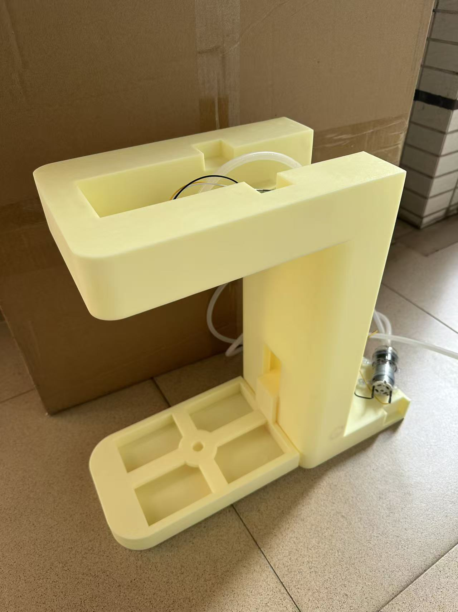

# Smart Water Dispenser (智能饮水机)


这是一个基于 STM32 和超声波传感技术的智能饮水机项目。该项目包含完整的硬件设计（PCB、3D模型）、嵌入式控制软件以及与之配套的超声波信号处理算法仿真工具。

## 项目简介

本项目旨在设计一款能够智能检测水杯、液位并自动控制出水的饮水机系统。核心亮点在于使用了自定义的信号处理算法来分析超声波回波信号，从而通过不同的回波特征（杯壁反射、液面反射等）精确识别容器状态，并以此设定动态阈值进行控制。


主要功能：
- **超声波液位/容器检测**：利用超声波模块获取回波信号，通过算法识别容器及其位置。
- **智能出水控制**：根据检测结果自动控制水泵启停。
- **阈值算法**：包含 Python 原型验证与 C 语言移植版本，确保检测的鲁棒性。

### 整体外观


## 📁 目录结构

```
.
├── Docs/                   # 项目文档
│   ├── 系统技术说明文档.pdf # 详细的技术实现与系统设计说明
│   ├── 超声波模块/          # 超声波模块相关资料
│   └── 演示视频/            # 系统功能演示
├── Hardware/               # 硬件设计资源
│   ├── 3D_Model/           # 外壳及结构件的 3D 模型文件
│   └── PCB/                # 电路设计文件 (EasyEDA Pro工程)
├── Tools/                  # 开发辅助工具
│   ├── Algo_Simulation/    # 超声波阈值算法的 Python 仿真与验证工具
│   └── 超声波模块测试工具/  # 早期测试工具
└── water_dispenser3/       # 嵌入式软件工程 (STM32CubeIDE)
    ├── Core/               # 核心代码 (main.c, ultrasonic_threshold.c 等)
    └── Drivers/            # HAL 库及驱动
```

## 🛠️ 硬件方案

- **主控芯片**：STM32F103C8T6
- **核心传感器**：基于 TDK CH101 的超声波测距模块 UETCH101DBB0900AT (可在淘宝店铺 奥佳诚电子商城 买到)
- **执行器**：直流微型水泵
- **电路设计**：使用立创 EDA (EasyEDA Pro) 设计，`Hardware/PCB` 目录下包含完整的工程文件。

## 💻 软件架构

### 1. 嵌入式软件 (`water_dispenser3`)
基于 STM32CubeIDE 开发，使用 HAL 库。
- **核心逻辑**：`Core/Src/main.c` 负责系统状态机与外设控制。
- **信号处理**：`Core/Src/ultrasonic_threshold.c` 是从 Python 版本移植而来的 C 语言算法实现，负责：
    - 信号平滑处理 (Moving Average)
    - 峰值检测 (Peak Detection)
    - 峰值分类与合并 (Peak Classification)
    - 动态阈值计算
- **控制模式**：支持 PWM 或 GPIO 模式控制水泵（可在 `main.c` 中配置）。

### 2. 算法仿真 (`Tools/Algo_Simulation`)
在将算法部署到 MCU 之前，我们使用 Python 对采集到的原始超声波数据进行分析和算法验证。详细说明请参考该目录下的 README。

## 🚀 快速开始

### 硬件准备
1. 参考 `Hardware/PCB` 制作电路板并完成焊接。
2. 按照 `Hardware/3D_Model` 打印外壳并组装。

### 软件烧录
1. 使用 STM32CubeIDE 打开 `water_dispenser3` 目录。
2. 编译工程（Release/Debug）。
3. 使用 ST-Link/J-Link 将固件烧录至 STM32F103C8T6。

### 算法调试
如果你需要调整超声波检测灵敏度：
1. 使用 `Tools/Algo_Simulation/UARTAss.py` 或其他串口工具连接设备。
2. 采集设备的原始波形数据 (`s:xxx,xxx...`)。
3. 利用 `Tools/Algo_Simulation` 中的脚本可视化数据并调整参数（详见子目录 README）。

## 📝 贡献
欢迎提交 Issue 或 Pull Request 来改进本项目，无论是算法优化还是硬件改进。

## 📄 许可证
本项目开源，请遵守相关许可证协议（如有）。
